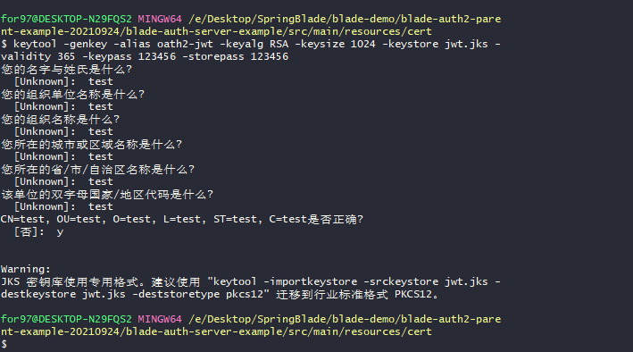
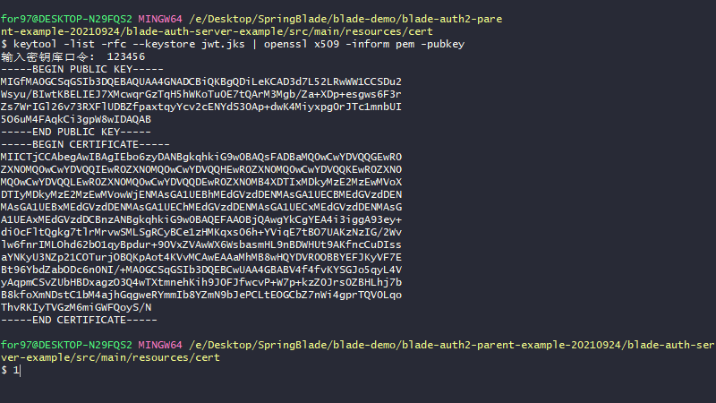

## 使用 keytool 工具生成密钥对

1、运行下面的命令生成私钥，姓名国家啥的可以不填:（在指定resource目录下执行）   
$ keytool -genkey -alias oath2-jwt -keyalg RSA -keysize 1024 -keystore jwt.jks -validity 365 -keypass 123456 -storepass 123456
  
  
说明：-alias 选项为别名，-keypass 和 -storepass 为密码选项，-validity 为配置 jks 文件的过期时间（单位：天）。

2、完成之后，要求转移到新的标准:  
$ keytool -importkeystore -srckeystore jwt.jks -destkeystore jwt.jks -deststoretype pkcs12

3、获取的 jks 文件作为私钥，是如何解密JWT的呢？这时就需要使用 jks 文件的公钥。获取jks文件的公钥命令如下：
$ keytool -list -rfc --keystore jwt.jks | openssl x509 -inform pem -pubkey
  
   
## initialize sql data

1、配置两个用户。

其中，读用户 reader 具有读权限，密码为 reader；
写用户 writer 具有读写权限，密码为 writer。   
--密码我们使用的是 BCryptPasswordEncoder 加密（准确说是哈希）？

`INSERT INTO `users` VALUES ('reader', '$2a$04$C6pPJvC1v6.enW6ZZxX.luTdpSI/1gcgTVN7LhvQV6l/AfmzNU/3i', 1);
INSERT INTO `users` VALUES ('writer', '$2a$04$M9t2oVs3/VIreBMocOujqOaB/oziWL0SnlWdt8hV4YnlhQrORA0fS', 1);`

2、配置两个权限，也就是配置 reader 用户具有读权限，writer 用户具有写权限：
`INSERT INTO `authorities` VALUES ('reader', 'READ');
INSERT INTO `authorities` VALUES ('writer', 'READ,WRITE');`

3、配置三个客户端：

其中客户端 userservice1 使用资源拥有者凭据许可类型
客户端 userservice2 使用客户端凭据许可类型
客户端 userservice3 使用授权码许可类型。

`INSERT INTO `oauth_client_details` VALUES ('userservice1', 'userservice', '1234', 'FOO', 'password,refresh_token', '', 'READ,WRITE', 7200, NULL, NULL, 'true');
INSERT INTO `oauth_client_details` VALUES ('userservice2', 'userservice', '1234', 'FOO', 'client_credentials,refresh_token', '', 'READ,WRITE', 7200, NULL, NULL, 'true');
INSERT INTO `oauth_client_details` VALUES ('userservice3', 'userservice', '1234', 'FOO', 'authorization_code,refresh_token', 'https://baidu.com,http://localhost:8082/ui/login,http://localhost:8083/ui/login,http://localhost:8082/ui/remoteCall', 'READ,WRITE', 7200, NULL, NULL, 'false');`

值得说明的是：

三个客户端账号能使用的资源 ID 都是 userservice，对应我们受保护资源服务器刚才配置的资源 ID，也就是 userservice，这两者需要一致。

三个客户端账号的密码都是 1234。

三个客户端账号的授权范围都是 FOO（并不是关键信息），它们可以拿到的权限是读写。不过，对于和用户相关的授权许可类型（比如资源拥有者凭据许可、授权码许可），最终拿到的权限还取决于客户端权限和用户权限的交集。

通过 grant_types 字段配置支持不同的授权许可类型。这里为了便于测试观察，我们给三个客户端账号各自配置了一种授权许可类型；在实际业务场景中，你完全可以为同一个客户端配置支持 OAuth 2.0 的四种授权许可类型。

userservice1 和 userservice2 我们配置了用户自动批准授权（不会弹出一个页面要求用户进行授权）

link:  
https://zq99299.github.io/note-book/oath2
https://github.com/it-wwh/spring-cloud-gateway-oauth2