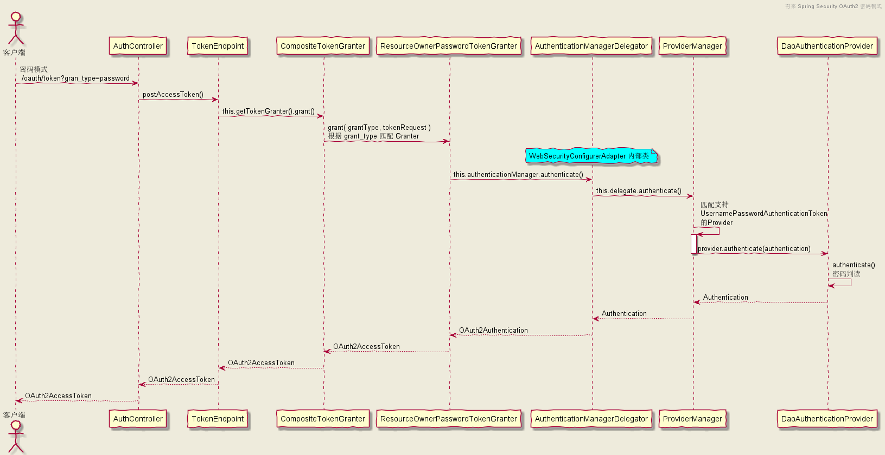
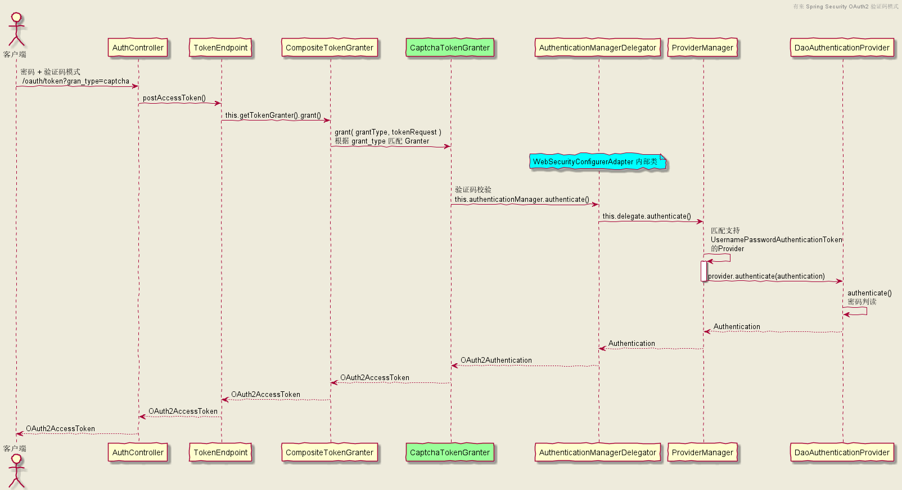
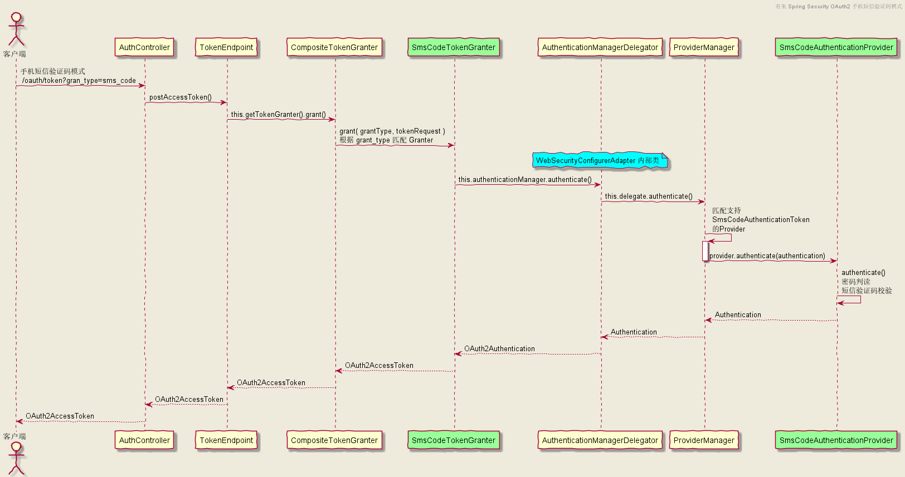

## 验证码授权模式

因为是基于密码授权模式的扩展，就先了解密码授权模式的流程吧。因为其他几种授权模式和密码模式实现原理都是一样，弄明白密码授权模式之后其他授权模式包括如何去扩展都是轻车熟路。

密码模式流程： 根据请求参数 grant_type 的值 password 匹配到授权者 ResourceOwnerPasswordTokenGraner ，授权者委托给认证提供者管理器 ProviderManager，根据 token 类型匹配到提供者 DaoAuthenticationProvider， Provider 从数据库获取用户认证信息和客户端请求传值的用户信息进行认证密码判读，验证通过之后返回token给客户端。

下面密码授权模式时序图贴出关键类和方法，断点走几遍流程就应该知道流程。

验证码授权模式时序图如下，仔细比对下和密码授权模式的区别。

比较可知两者的区别基本就是授权者 Granter 的区别，后续的 Provider 获取用户认证信息和密码判断完全一致，具体新增的验证码模式授权者 CaptchaTokenGranter 和密码模式的授权者 ResourceOwnerPasswordTokenGraner 区别在于前者的 getOAuth2Authentication() 方法获取认证信息添加了校验验证码的逻辑，具体的代码实现在实战里交待。

## 手机短信验证码

手机短信验证码模式时序图如下，变动的角色还是用绿色背景标识。可以看到扩展是对授权者 Granter 和认证提供者 Provider 做切入口。

手机短信验证码授权流程： 流程基本上和密码模式一致，根据 grant_type 匹配授权者 SmsCodeTokenGranter , 委托给 ProviderManager 进行认证，根据 SmsCodeAuthenticationToken的匹配认证提供者 SmsCodeAuthenticationProvider 进行短信验证码校验。

来自：  
https://www.cnblogs.com/haoxianrui/p/15421760.html
https://www.its404.com/article/qq_43437874/119790536