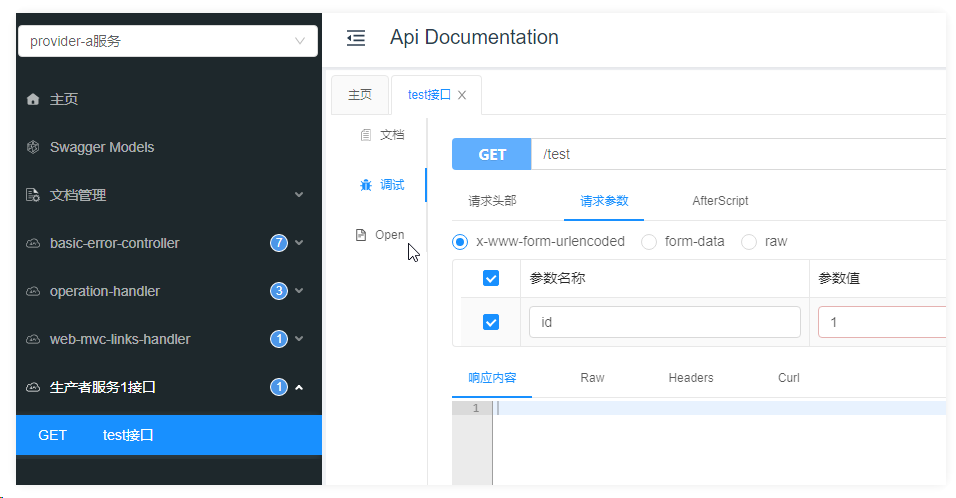
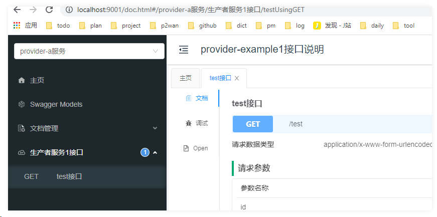

#微服务文档聚合

在微服务架构下，如果给每个微服务都配置文档，那么每个微服务的接口文档都有自己独立的访问地址，这样要一个个打开每个微服务的文档非常麻烦。一般我们会采用聚合的办法，将所有微服务的接口整合到一个文档中。

传统的整合方法需要在gateway中进行大量配置，十分繁琐。自2.0.8版本开始，Knife4j 提供了knife4j-aggregation-spring-boot-starter组件，该组件是一个基于Spring Boot系统的starter，他提供了以下几种能力：

最轻量级、最简单、最方便的聚合OpenApi规范的中间件
让所有的基于Spring Boot的Web体系拥有了轻松聚合OpenApi的能力
提供4种模式供开发者选择
- 基于本地静态JSON文件的方式聚合OpenAPI 
- 基于云端HTTP接口的方式聚合
- 基于Eureka注册中心的方式聚合
- 基于Nacos注册中心的方式聚合

##cloud模式

cloud模式原理是，在聚合文档工程配置每个微服务的http接口资源地址，这样聚合文档工程启动的时候可以访问到每个微服务的http接口文档资源地址，从而聚合每个微服务的接口文档

- 这种方式可以用在没有注册中心，每个SpringBoot微服务单独启动的场景
- 由于聚合文档工程需要能访问到每个微服务的http接口文档资源地址才能做聚合，所以在聚合文档工程启动之前要先启动需要被聚合的每个微服务，并且每个微服务自己要做好swagger文档的相关配置

knife4j.cloud.enable:将该属性设置为true，则代表启用Cloud模式
knife4j.cloud.routeAuth:该属性是一个公共Basic验证属性(可选)，如果开发者提供的OpenAPI规范的HTTP接口需要以Basic验证进行鉴权访问，那么可以配置该属性，如果配置该属性，则该模式下所有配置的Routes节点接口都会以Basic验证信息访问接口
knife4j.cloud.routeAuth.enable:是否启用Basic验证
knife4j.cloud.routeAuth.usernae:Basic用户名
knife4j.cloud.routeAuth.password:Basic密码
knife4j.cloud.routes:需要聚合的服务集合(必选)，可以配置多个
knife4j.cloud.routes.name:服务名称(显示名称，最终在Ui的左上角下拉框进行显示)
knife4j.cloud.routes.uri:该服务的接口URI资源，如果是HTTPS，则需要完整配置
knife4j.cloud.routes.location::具体资源接口地址，最终Knife4j是通过uri+location的组合路径进行访问
knife4j.cloud.routes.swaggerVersion:版本号，默认是2.0，可选配置
knife4j.cloud.routes.servicePath:该属性是最终在Ui中展示的接口前缀属性，提供该属性的目的也是因为通常开发者在以Gateway等方式聚合时，需要一个前缀路径来进行转发，而最终这个前缀路径会在每个接口中进行追加
knife4j.cloud.routes.routeAuth:如果该Route节点的接口开启了Basic，并且和公共配置的Basic不一样，需要单独配置
knife4j.cloud.routes.routeAuth.enable:是否启用Basic验证
knife4j.cloud.routes.routeAuth.usernae:Basic用户名
knife4j.cloud.routes.routeAuth.password:Basic密码

##Nacos模式

Nacos模式原理是，在聚合文档工程配置每个微服务的Nacos注册中心地址和服务名称，这样聚合文档工程启动的时候可以从Nacos访问到每个微服务的http接口文档资源地址，从而聚合每个微服务的接口文档

关于nacos下的自定义配置SwaggerConfig：

该配置并不是必须的，当缺省时，微服务下的接口一样会被扫描进接口文档里面。

缺省时的效果如下：

对比 配置了SwaggerConfig的效果：

###配置参数

knife4j.nacos.enable:将该属性设置为true，则代表启用nacos模式
knife4j.nacos.serviceUrl:nacos注册中心的地址
knife4j.nacos.routeAuth:该属性是一个公共Basic验证属性(可选)，如果开发者提供的OpenAPI规范的服务需要以Basic验证进行鉴权访问，那么可以配置该属性，如果配置该属性，则该模式下所有配置的Routes节点接口都会以Basic验证信息访问接口
knife4j.nacos.routeAuth.enable:是否启用Basic验证
knife4j.nacos.routeAuth.usernae:Basic用户名
knife4j.nacos.routeAuth.password:Basic密码
knife4j.nacos.routes:需要聚合的服务集合(必选)，可以配置多个
knife4j.nacos.routes.name:服务名称(显示名称，最终在Ui的左上角下拉框进行显示)，如果该属性不配置，最终Ui会显示serviceName
knife4j.nacos.routes.serviceName:nacos注册中心的服务名称
knife4j.nacos.routes.groupName:Nacos分组名称,非必须,开发者根据自己的实际情况进行配置
knife4j.nacos.routes.namespaceId:命名空间id,非必须,开发者根据自己的实际情况进行配置
knife4j.nacos.routes.clusters:集群名称,多个集群用逗号分隔,非必须,开发者根据自己的实际情况进行配置
knife4j.nacos.routes.uri:该服务的接口URI资源，如果是HTTPS，则需要完整配置
knife4j.nacos.routes.location::具体资源接口地址，最终Knife4j是通过注册服务uri+location的组合路径进行访问
knife4j.nacos.routes.swaggerVersion:版本号，默认是2.0，可选配置
knife4j.nacos.routes.servicePath:该属性是最终在Ui中展示的接口前缀属性，提供该属性的目的也是因为通常开发者在以Gateway等方式聚合时，需要一个前缀路径来进行转发，而最终这个前缀路径会在每个接口中进行追加
knife4j.nacos.routes.routeAuth:如果该Route节点的接口开启了Basic，并且和公共配置的Basic不一样，需要单独配置
knife4j.nacos.routes.routeAuth.enable:是否启用Basic验证
knife4j.nacos.routes.routeAuth.usernae:Basic用户名
knife4j.nacos.routes.routeAuth.password:Basic密码

参考：  
https://baobao555.tech/posts/bfc50ac6/
https://doc.xiaominfo.com/knife4j/resources/aggregation-nacos.html
https://blog.csdn.net/ABestRookie/article/details/121566331